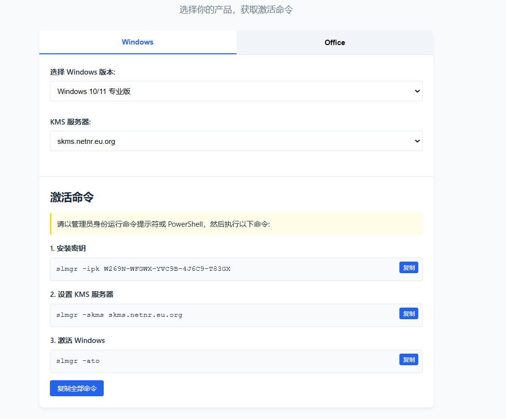

# KMS 激活工具 Web 界面

这是一个简洁易用的Web界面，可帮助用户快速生成 Windows 和 Office 产品的 KMS 激活命令。



## 功能特点

- **产品选择**：支持激活 Windows 11/10/8.1/8/7 和各种 Windows Server 版本
- **Office 支持**：支持激活 Office 2016/2013/2010 各版本
- **自动生成命令**：根据选择自动生成相应的激活命令序列
- **自定义服务器**：支持指定自定义 KMS 服务器地址
- **一键复制**：单独复制每条命令或一次复制全部命令
- **响应式设计**：适配桌面和移动设备屏幕

## 技术实现

- 纯静态实现，使用原生 HTML、CSS 和 JavaScript
- 无需后端支持，可直接在浏览器中运行
- 代码结构清晰，易于维护和扩展

## 文件结构

```
web/
├── index.html     # 主 HTML 文件
├── styles.css     # CSS 样式表
├── script.js      # JavaScript 功能脚本
└── README.md      # 说明文档
```

## 使用方法

### 本地使用

直接在浏览器中打开 `index.html` 文件即可使用。

### 作为 Docker 容器的一部分

本 Web 界面已集成到 vlmcsd Docker 镜像中，运行容器后可通过 Web 端口访问。

```bash
docker run -d --name vlmcsd -p 1688:1688 -p 80:80 yourusername/vlmcsd
```

访问 `http://your-server-ip` 或 `http://localhost` 使用界面。

## 操作指南

1. 选择产品类型（Windows 或 Office）
2. 选择具体产品版本（如 Windows 11 专业版）
3. 选择或输入 KMS 服务器地址
4. 系统会自动生成相应的激活命令
5. 使用复制按钮复制命令
6. 在目标系统的管理员命令提示符或 PowerShell 中执行复制的命令

## 开发与定制

如需修改或扩展功能，可以直接编辑相应的文件：

- 修改 `index.html` 调整界面结构
- 修改 `styles.css` 更改界面样式
- 修改 `script.js` 添加或更改功能逻辑

添加新的产品支持时，请在 `script.js` 的 `activationKeys` 对象中添加相应的产品密钥。

## 浏览器兼容性

- Chrome 60+
- Firefox 55+
- Edge 79+
- Safari 11+
- Opera 47+

## 改进计划

- 添加多语言支持
- 增加深色模式
- 将命令保存为批处理文件功能
- 添加更多操作系统和产品版本支持

## 许可

本项目基于 MIT 许可证，仅供学习研究和技术交流使用。 